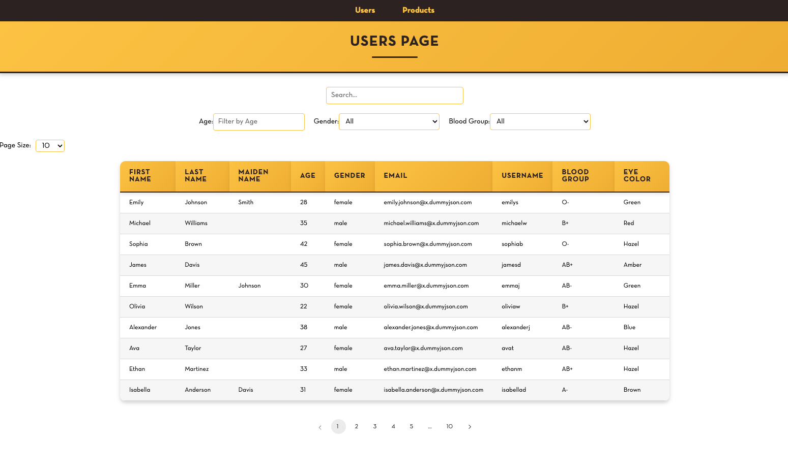
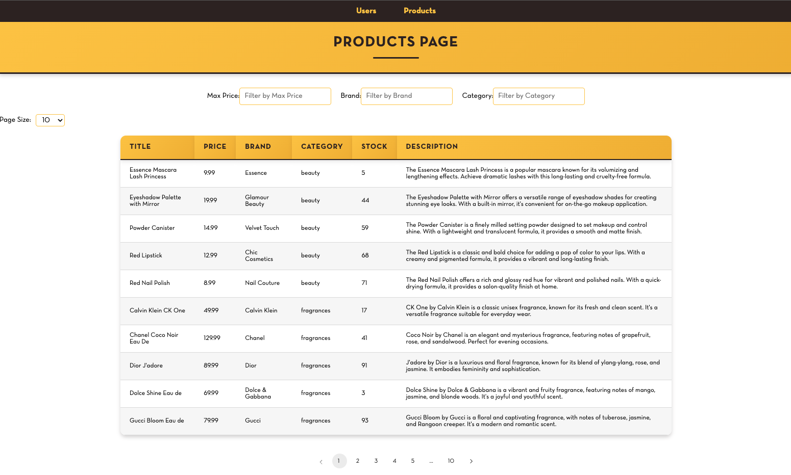

# React Data Filtering and Pagination Application

This project is a React-based application that displays user and product data with filtering, pagination, and search functionalities. The app fetches data from the [DummyJSON API](https://dummyjson.com/), and allows the user to filter, search, and paginate through the data.

## Features

- **Dynamic Table**: The app displays a table of user or product data.
- **Pagination**: Users can change pages using a pagination component.
- **Page Size Selection**: Users can choose how many items are displayed per page (5, 10, 20, 50).
- **Search**: Users can search through the entire dataset (not just the visible items) using a search box.
- **Filters**: Users can filter the data based on various fields:
  - Users: Filter by age, gender, and blood group.
  - Products: Filter by price, brand, and category.





## Technologies Used

- **React**: Frontend framework for building the UI.
- **Axios**: For making API requests.
- **React Router**: For managing page navigation.
- **SCSS**: For styling the components.
- **DummyJSON API**: Used to fetch mock data.

## Getting Started

### Prerequisites

Make sure you have the following installed:

- Node.js (v14+)
- npm or yarn

### Installation

1. Clone the repository:

   ```bash
   git clone https://github.com/delfrinandopranata/react-user-product.git
   ```

2. Navigate to the project directory:

   ```bash
   cd react-user-product
   ```

3. Install dependencies:

   ```bash
   npm install
   ```

   or

   ```bash
   yarn install
   ```

4. Start the development server:

   ```bash
   npm start
   ```

   or

   ```bash
   yarn start
   ```

The app will now be running on `http://localhost:3000`.

## API Used

The app uses the [DummyJSON API](https://dummyjson.com/) to fetch mock data. The data is fetched from the following endpoints:

- **Users Data**: `https://dummyjson.com/users?limit=100`
- **Products Data**: `https://dummyjson.com/products?limit=100`

## Project Structure

The project is structured as follows:

```
src/
|-- components/
|-- pages/
|   |-- UserPage.js            # Page for displaying user data with filtering and pagination
|   |-- ProductPage.js         # Page for displaying product data with filtering and pagination
|-- config/
|-- App.js                     # Main application file with routing
|-- index.js                   # Entry point for the React application
```

### Main Components

- **`Table.js`**: Renders the table of data with dynamic columns.
- **`Pagination.js`**: Handles pagination and page changes.
- **`UserPage.js`**: Displays user data, search, and filter features.
- **`ProductPage.js`**: Displays product data, search, and filter features.

### Styling

The styling is handled using SCSS. You can find the main styles for the table and pagination in the `tableStyles.scss` file under the `components` directory.

## Usage

- **Users Page**: Visit `/users` to view and filter user data.
- **Products Page**: Visit `/products` to view and filter product data.
- **Filtering**: Use the filter inputs for age, gender, and blood group (for users) or price, brand, and category (for products).
- **Search**: Use the search box to search through all data fields (not just the displayed page).
- **Page Size**: Change the number of items displayed per page using the dropdown.

## Future Enhancements

- Add more advanced filtering options (e.g., date ranges, multiple field filters).
- Implement sorting functionality for each column.
- Improve the responsiveness and mobile UI experience.

## License

This project is open source and available under the [MIT License](LICENSE).

## Author

Developed by Delfrinando Pranata. You can find more details and the repository [here](https://github.com/delfrinandopranata/react-user-product).

## Acknowledgments

- The mock data is provided by [DummyJSON](https://dummyjson.com/).
